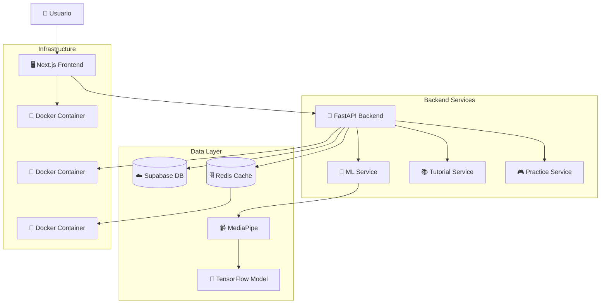

# COMSIGNS V2 - Sistema de Traducción de Lenguaje de Señas

**COMSIGNS** es una aplicación web innovadora que utiliza **Inteligencia Artificial** para traducir el lenguaje de señas ecuatoriano en tiempo real, facilitando la comunicación e inclusión de la comunidad sordomuda.

## 🎯 **Objetivo del Proyecto**

Desarrollar una plataforma tecnológica que permita a personas sordas y oyentes comunicarse de manera efectiva mediante el reconocimiento automático de señas del alfabeto ecuatoriano, promoviendo la inclusión y accesibilidad.

## **Funcionalidades Principales**

### 🧠 **Reconocimiento Inteligente**
- **Predicción en tiempo real** de letras del alfabeto ecuatoriano (A-Y)
- **Procesamiento de imágenes** mediante cámara web o carga de archivos
- **Precisión superior al 85%** en condiciones óptimas
- **Validación de confianza** configurable por nivel de usuario

### 🎓 **Tutorial Interactivo**
- **24 lecciones estructuradas** para aprender el alfabeto completo
- **Orden pedagógico** progresivo (de fácil a difícil)
- **Consejos específicos** y técnicas para cada letra
- **Progreso automático** y seguimiento personalizado

### 🏆 **Modo Práctica Gamificado**
- **3 niveles de dificultad**: Principiante, Intermedio, Avanzado
- **Sistema de puntuación** con bonus por velocidad y precisión
- **Desafíos cronometrados** para mejorar habilidades
- **Tabla de clasificación** comunitaria

### 📊 **Analytics y Progreso**
- **Métricas detalladas** de rendimiento por usuario
- **Estadísticas de aprendizaje** y áreas de mejora
- **Historial de sesiones** y evolución temporal
- **Reportes exportables** para educadores

## 🛠️ **Stack Tecnológico**

### **Frontend**
-  **Next.js 14** con App Router
-  **TypeScript** para tipado estático
-  **Tailwind CSS** para diseño responsivo
-  **shadcn/ui** para componentes accesibles

### **Backend**
-  **FastAPI** como framework web asíncrono
-  **Python 3.13** como lenguaje principal
-  **Pydantic** para validación de datos

### **Machine Learning**
-  **TensorFlow 2.18** para modelos de IA
-  **MediaPipe** para detección de landmarks
-  **OpenCV** para procesamiento de imágenes
-  **NumPy** para cálculos numéricos

### **Base de Datos & Cache**
-  **Supabase** como base de datos principal (PostgreSQL)
-  **Redis** para cache y sesiones

### **DevOps & Deployment**
-  **Docker** para containerización
-  **Docker Compose** para orquestación

## 🏗️ **Arquitectura del Sistema**



### **Flujo de Datos Principal**

1. **Captura**: Usuario captura imagen de seña desde cámara/archivo
2. **Procesamiento**: MediaPipe extrae landmarks de la mano (21 puntos × 3 coordenadas)
3. **Normalización**: Coordenadas se normalizan y preparan para el modelo
4. **Predicción**: TensorFlow predice la letra con nivel de confianza
5. **Validación**: Sistema valida confianza y retorna resultado
6. **Persistencia**: Progreso y métricas se guardan en Supabase
7. **Cache**: Datos frecuentes se almacenan en Redis para velocidad

## 🚀 **Instalación y Uso**

### **Prerrequisitos**
-  Docker 20.10+
-  Docker Compose 2.0+
- Puertos disponibles: `3000`, `8000`, `6379`

### **Inicio Rápido**

```bash
# 1. Clonar el repositorio
git clone https://github.com/MarLord06/ComSigns-V2.git
cd ComSigns-V2

# 2. Configurar variables de entorno
cp .env.example .env

# 3. Levantar todos los servicios
./start-dev.sh
```

### **Acceso a la Aplicación**

| Servicio | URL | Descripción |
|----------|-----|-------------|
| 🖥️ **Frontend** | http://localhost:3000 | Aplicación web principal |
| 🚀 **API** | http://localhost:8000 | Backend REST API |
| 📖 **Docs** | http://localhost:8000/docs | Documentación interactiva Swagger |
| 📚 **ReDoc** | http://localhost:8000/redoc | Documentación alternativa |

### **Scripts Disponibles**

```bash
# Desarrollo rápido
./start-dev.sh          # Inicia todos los servicios en desarrollo

# Build optimizado
./quick-build.sh        # Construye imágenes con cache optimizado

# Docker manual
docker-compose -f docker-compose.dev.yml up -d    # Servicios desarrollo
docker-compose -f docker-compose.fast.yml up -d   # Build optimizado
```

## 📚 **Documentación**

### **Documentación de la API**
Para información detallada sobre endpoints, autenticación, y ejemplos de uso, consulta nuestra [**📖 Documentación Completa de la API**](./docs/API.md).

### **Recursos Adicionales**
- **[🧠 Guía del Modelo ML](./docs/ML_Guide.md)** - Detalles del modelo de IA
- **[🎓 Tutorial de Desarrollo](./docs/Development.md)** - Guía para desarrolladores
- **[🚀 Guía de Despliegue](./docs/Deployment.md)** - Instrucciones de producción

## 🧪 **Testing**

```bash
# Backend tests
docker exec -it comsigns-backend pytest

# Tests con coverage
docker exec -it comsigns-backend pytest --cov=app tests/

# Frontend tests
cd frontend && npm test
```

## 🤝 **Contribuciones**

¡Las contribuciones son bienvenidas! Por favor:

1. **Fork** el proyecto
2. **Crea** tu rama de feature (`git checkout -b feature/nueva-funcionalidad`)
3. **Commit** tus cambios (`git commit -m 'Añadir nueva funcionalidad'`)
4. **Push** a la rama (`git push origin feature/nueva-funcionalidad`)
5. **Abre** un Pull Request


## 📄 **Licencia**

Este proyecto está bajo la Licencia MIT - ver el archivo [LICENSE](LICENSE) para detalles.

## 👥 **Equipo de Desarrollo**

- **[MarLord06](https://github.com/MarLord06)** - Desarrollador Principal
- **Comunidad COMSIGNS** - Colaboradores y testers

## 🙏 **Agradecimientos**

- **Comunidad sordomuda ecuatoriana** por su invaluable feedback
- **Fundación Nacional de Sordos del Ecuador** por su apoyo
- **Universidad Técnica del Norte** por el respaldo académico
- **Contributors Open Source** por sus aportes al proyecto

---

**🤟 Desarrollado para promover la inclusión y accesibilidad**

[](https://fastapi.tiangolo.com/)
[](https://nextjs.org/)
[](https://tensorflow.org/)
[](#)